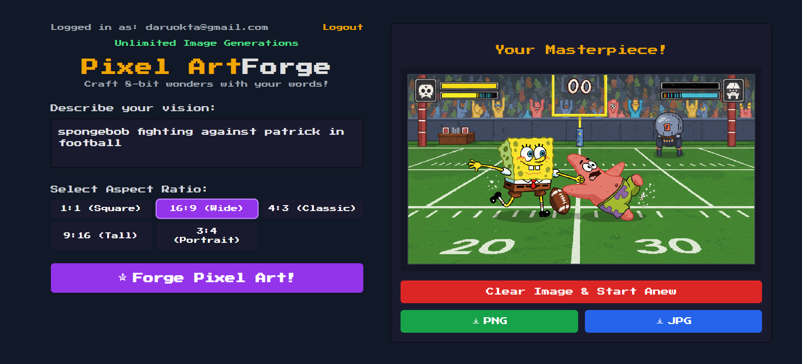
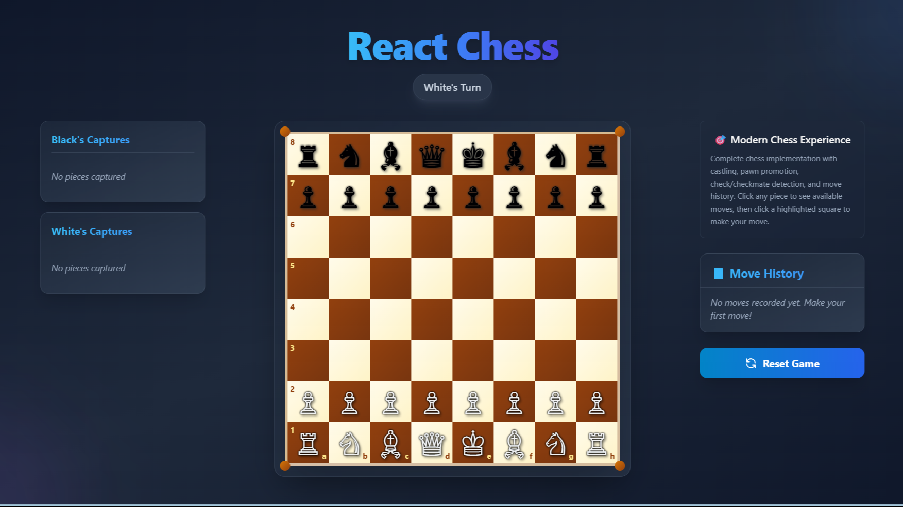

# 🏂 Daru Okta Buana
**`Chess and AI enthusiast`**

 

🎯 **Building the future, one algorithm at a time.** From crafting intelligent chess engines to architecting next-gen AI systems, I transform complex problems into elegant solutions. Currently deep-diving into LLMs, RAG pipelines, and multi-agent frameworks—because the best way to predict the future is to code it.

*Where strategic thinking meets cutting-edge technology.*

## 🚀 Featured Projects

### 🎨 Pixel Art Generator

  

A web application that generates unique pixel art based on text prompts using Google's Gemini AI.
- **Tech Stack:** React, TypeScript, Vite, Tailwind CSS, Google Gemini API
- **Features:** AI-powered image generation, simple UI
- **[🚀 VISIT IT!](https://github.com/daruoktab/pixel-art-generator)**

### 🎮 Interactive Chess Game
A fully functional chess game built with modern web technologies, featuring drag-and-drop gameplay and real-time validation.

  

- **Tech Stack:** React, Tailwind CSS, Chess.js, JavaScript, HTML5
- **Features:**
    - 🎯 **Drag & Drop Interface** - Intuitive piece movement
    - 🧠 **Smart Validation** - Legal moves only (Legal move validation, checkmate detection)
    - 🏆 **Game Status** - Real-time check/checkmate detection
    - 🔄 **New Game** - Reset anytime
    - Responsive design
- **[🚀 PLAY NOW](https://daruoktab.github.io/react-tailwind-chess/)**

### 🤖 AI & Machine Learning
Currently exploring cutting-edge applications in:
- **Large Language Models (LLMs)** - Fine-tuning and deployment
- **RAG Systems** - Retrieval-augmented generation pipelines  
- **Agentic Frameworks** - Multi-agent AI systems
- **Computer Vision** - YOLO, OpenCV implementations

## 🌐 Socials:
- 📫 **Reach out:** [Email](mailto:daruokta@gmail.com)
- 💼 **LinkedIn:** [Daru Okta Buana](https://www.linkedin.com/in/daru-okta-buana/)

## 💻 Tech Stack:

### **Python Ecosystem**
| **Language** | **Backend** | **Database** |
|:------------:|:-----------:|:------------:|
|  |  |  |
| |  |  |
| | |  |

### **Python Libraries & Frameworks**
| **Data Science** | **Machine Learning** | **Web Scraping** | **Computer Vision** |
|:----------------:|:--------------------:|:----------------:|:-------------------:|
|  |  |  |  |
|  |  |  |  |
|  |  | | |
|  |  | | |
|  |  | | |

### **Computational Mathematics**
| **Language & Platform** |
|:------------------------:|
|  |

### **JavaScript/TypeScript Ecosystem**
| **Language** | **Backend** | **Database** | **Libraries** |
|:------------:|:-----------:|:------------:|:-------------:|
|  |  |  |  |
|  |  |  |  |
|  |  |  |  |
| |  | |  |
| |  | |  |
| |  | |  |
| |  | |  |

### **AI/LLM/Agents**
| **Language Models** | **AI Frameworks** | **Vector Databases** | **Agent Frameworks** |
|:-------------------:|:-----------------:|:--------------------:|:--------------------:|
|  |  |  |  |
|  |  |  |  |
|  |  | |  |
|  | | |  |
|  | | |  |

### **Tools & DevOps**
| **Development** | **Design** |
|:---------------:|:----------:|
|  |  |
|  | |
|  | |

